# coolregex.fyi


Welcome to **coolregex.fyi**, a powerful tool for working with regular expressions, built using [Next.js](https://nextjs.org/). This project was bootstrapped with [`create-next-app`](https://github.com/vercel/next.js/tree/canary/packages/create-next-app).

📖 Read the full case study on my website [nicholasadamou.com/projects/coolregex](https://nicholasadamou.com/projects/coolregex).

## Table of Contents

-  [Getting Started](#getting-started)
-  [Features](#features)
-  [Architecture](#architecture)
-  [Development](#development)
-  [Learn More](#learn-more)
-  [Deploy on Vercel](#deploy-on-vercel)
-  [License](#license)

## Getting Started

To get a local copy up and running, follow these steps.

### Prerequisites

Make sure you have [Node.js](https://nodejs.org/) and npm (or yarn, pnpm, bun) installed on your machine.

### Installation

1. Clone the repository:

   ```bash
   git clone https://github.com/nicholasadamou/coolregex.git
   cd coolregex
   ```

2. Install dependencies:

   ```bash
   npm install
   # or
   yarn install
   # or
   pnpm install
   # or
   bun install
   ```

## Development

### Running the Development Server

Start the development server with the following command:

```bash
npm run dev
# or
yarn dev
# or
pnpm dev
# or
bun dev
```

Open [http://localhost:3000](http://localhost:3000) in your browser to view the application.

You can start editing the page by modifying `app/page.tsx`. The page will auto-update as you edit the file.

This project uses [`next/font`](https://nextjs.org/docs/basic-features/font-optimization) to automatically optimize and load Inter, a custom Google Font.

## Features

-  **Regex Testing**: Easily test and debug regular expressions.
-  **Real-time Updates**: See changes in real-time as you edit your regex.
-  **Custom Fonts**: Optimized loading of Google Fonts for better performance.
-  **Syntax Highlighting**: Colorful highlighting of regex components for better readability.
-  **Command Bar**: Quick search and navigation through regex patterns.

## Architecture

### Component Hierarchy


### Data Flow


### Component Interaction

```mermaid
sequenceDiagram
    participant User
    participant CommandBar
    participant Page as app/page.tsx
    participant RegexCard
    participant RegexHighlighter

    User->>CommandBar: Search for regex (⌘K)
    CommandBar->>Page: Update search term
    Page->>RegexCard: Filter and render cards
    RegexCard->>RegexHighlighter: Render highlighted regex
    User->>RegexCard: Click test button
    RegexCard->>RegexCard: Toggle test section
    User->>RegexCard: Enter test string
    RegexCard->>RegexCard: Validate against regex
    RegexCard->>User: Show match result
```



### Core Components

#### RegexHighlighter
The `RegexHighlighter` component provides syntax highlighting for regular expressions, making them easier to read and understand. It parses the regex string and applies different styles to different parts of the regex (character classes, quantifiers, groups, etc.).

#### CommandBar
The `CommandBar` component provides a searchable interface for finding specific regex patterns. It can be activated with keyboard shortcuts (⌘K) and filters the available regex patterns based on user input.

#### RegexCard
The `RegexCard` component displays a regex pattern with its title, description, and provides functionality to test the regex against a user-provided string. It also allows copying the regex to the clipboard.

## Learn More

To learn more about Next.js, check out the following resources:

-  [Next.js Documentation](https://nextjs.org/docs) - Learn about Next.js features and API.
-  [Learn Next.js](https://nextjs.org/learn) - An interactive Next.js tutorial.

You can also visit the [Next.js GitHub repository](https://github.com/vercel/next.js/) for more information and to contribute feedback or code.

## Deploy on Vercel

The easiest way to deploy your Next.js app is to use the [Vercel Platform](https://vercel.com/new?utm_medium=default-template&filter=next.js&utm_source=create-next-app&utm_campaign=create-next-app-readme) from the creators of Next.js.

Check out our [Next.js deployment documentation](https://nextjs.org/docs/deployment) for more details.

## License

Distributed under the MIT License. See [`LICENSE`](LICENSE) for more information.
